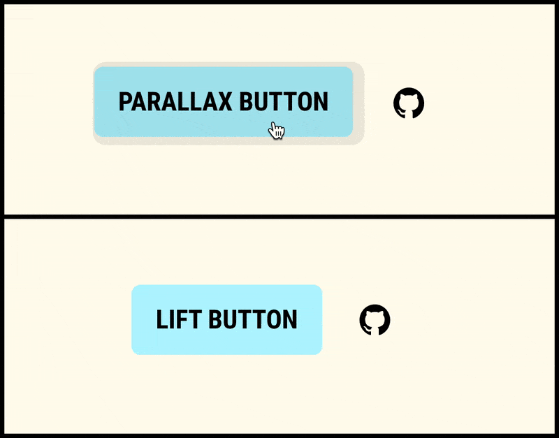

# CUSTOM CURSOR
#### A cursor that takes the shape of the hovered element. Inspired by [iPad Pointer](https://developer.apple.com/videos/play/wwdc2020/10640).

---

## Demo and usage

## 👉🏽 [pavellaptev.github.io/context-cursor](https://pavellaptev.github.io/context-cursor/) 👈🏽
